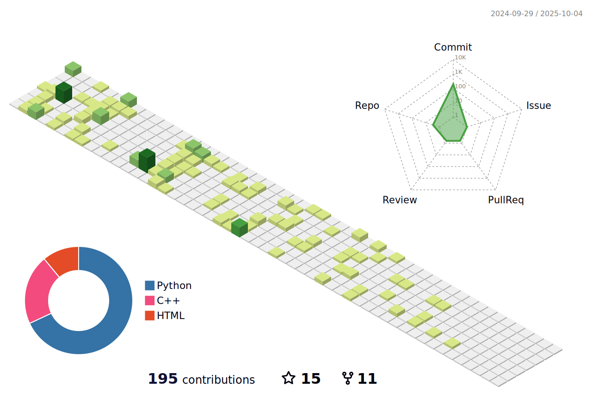

### Hi there 👋

<!--
**S-CHOI-S/S-CHOI-S** is a ✨ _special_ ✨ repository because its `README.md` (this file) appears on your GitHub profile.

Here are some ideas to get you started:

- 🔭 I’m currently working on ...
- 🌱 I’m currently learning ...
- 👯 I’m looking to collaborate on ...
- 🤔 I’m looking for help with ...
- 💬 Ask me about ...
- 📫 How to reach me: ...
- 😄 Pronouns: ...
- ⚡ Fun fact: ...
-->

### **S-CHOI-S** 

 

---

<h3 align="left"> 🌿 Tech Stack 🌿 </h3>

  

    
    
    
     
    
    
     
    
    
  

<h3 align="left"> ✈️ Follow Me ✈️ </h3>

  

            <!--&nbsp-->
    
    <a href="https://pineasol.notion.site/S-log-624ce31860574aac91f76440167f85dc">
      
    
    
  

<!--"그래프 모양"-->
<!---->

